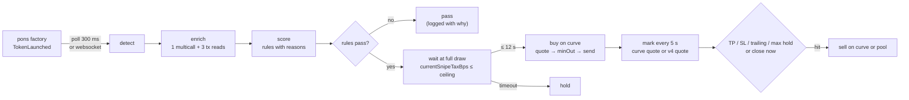

# Architecture

Bodkin is a single Node process. No database, no service, no daemon: `data/` holds two JSON files, and every number on screen was read
from Robinhood Chain in the last few seconds.

```
src/
├── cli.ts               doctor · hunt · watch · scan · fees · dev
├── cli-trade.ts         commands that can move money: snipe · buy · sell · positions · wallet · claim · board (dry run by default)
├── chain.ts             chain 4663, contract addresses, the two gated clients, optional websocket
├── abi/                 pons v2 (factory, curve, token, escrow, launch router) · Uniswap v4 (router, quoter, state view, permit2)
├── pons/
│   ├── launches.ts      detection: websocket subscription or 300 ms block-range polling; backfill; find one launch
│   ├── enrich.ts        one Multicall3 + three tx reads per launch: metadata, factory record, curve state, dev buy, exemptions
│   ├── curve.ts         constant-product math in the protocol's integer order; quotes; the opening-tax cap
│   ├── deployerIndex.ts who launched what, built once at startup and fed by the live stream; the enrichment limiter
│   ├── fingerprint.ts   launch-farm detection: identical dev buy, tax and links from different wallets inside 30 minutes
│   ├── fees.ts          creator-fee forensics from the escrow's own Credited / Claimed events
│   └── dev.ts           deployer history for `dev` and `scan`
├── score.ts             rule-based 0–100 score with reasons
├── snipe.ts             the engine: decide → wait for the opening tax → buy → mark every 5 s → exit; pause, resume, close
├── trade/
│   ├── curveTrade.ts    buy / sell on the bonding curve
│   ├── poolTrade.ts     buy / sell on the graduated Uniswap v4 pool; route by phase; live valuation
│   ├── v4.ts            pool key from the factory record, pool id, StateView, V4Quoter, UniversalRouter calldata (both layouts)
│   ├── positions.ts     JSON store and the pure exit-rule function
│   └── wallet.ts        the only file that touches PRIVATE_KEY
├── board/               loopback HTTP + SSE + one HTML page; four POST verbs into the engine
├── alerts/telegram.ts   optional Bot API notifications on fire / exit
└── util/                env loader, formatting, ETH/USD, retry, terminal colors, the wordmark, the RPC gate
```

## Data flow of one launch



## Why these choices

- **Subscription first, polling second.** Robinhood Chain has no public mempool; the sequencer orders first-come-first-served and broadcasts
  blocks it has already built. The earliest anyone can see a launch is the block it landed in. publicnode runs a free websocket for the chain,
  so by default a launch arrives as a log push; `RPC_WS_URL=off` falls back to a 300 ms block-range poll that slows itself down when refused.
- **Two public endpoints, one gate, no JSON-RPC batches.** The official RPC returns 429 above roughly eight concurrent calls, counts every
  call inside a batch array, meters `eth_getLogs` separately and challenges noisy clients; publicnode is fast and generous but refuses
  `eth_getLogs`. `util/rpcGate.ts` keeps a list of endpoints with capabilities and routes each method to the first healthy one that serves it,
  with bounded concurrency, minimum spacing (tighter for logs), a process-wide cooldown after a 429, a penalty box per endpoint, and retries
  that wait instead of failing. Fifteen contract reads per launch go through the canonical Multicall3 as one `eth_call`.
- **Deployer history from memory.** A chunked `getLogs` in the background at startup indexes every launch and graduation in the last
  400 000 blocks (about eleven hours); each new launch costs the index nothing, and if the public endpoint refuses the startup query the feed
  runs without deployer history and the build retries every two minutes. Before this, every launch triggered a 400 000-block log query and
  the public endpoint answered bursts with errors.
- **Wait, do not race.** The curve charges a 99 % opening tax that decays to zero in 3 seconds. The engine polls the tax for its own recipient
  every 150 ms and fires when it is under the ceiling (default 3 %). Measured entries land 190–200 ms after detection at 0–0.19 %.
- **Quotes in the protocol's own integer order.** `pons/curve.ts` reproduces `PonsV2BondingCurve.buy/sell` step by step so that
  `minTokensOut` is computed from the same rounding the contract will use.
- **Two venues, one router decision.** Before graduation the curve is the venue. After graduation the token trades in a Uniswap v4 pool behind
  the pons hook, keyed by the pair token and tick spacing the factory recorded for that launch. `sellAnywhere` reads the phase from the factory
  and refuses to trade during the swept gap between the two.
- **The board is a view with four verbs.** It binds 127.0.0.1, streams engine events, and accepts pause, resume, close a position, and edit
  a bounded rule. No route makes the *engine* buy; `--live` is a launch flag.
- **`--wallet` adds three build-only routes.** With that flag, and only then, `/api/tx/{buy,sell,claim}` return unsigned
  `{to, data, value}` for a browser wallet to sign. The server holds no key on this path and cannot broadcast: the person's
  wallet shows each transaction and they sign or refuse. It is a second, human-driven venue beside the engine, not a way to
  make the engine fire, and the automated sniper still needs its own key because it cannot wait for a click.

## What is deliberately not here

Copy trading, limit orders, multi-wallet, bundling, a hosted bot, MEV tricks. The chain has no priority-fee ordering to exploit and the
product has no server to trust.
